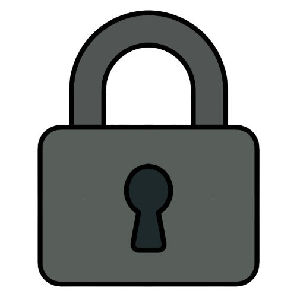

<div align="center">
  
  <p><strong>LockBox: </strong>Self-hosted E2EE password manager for secure online credentials.<br>Written in Python/FastAPI</p>
</div>

## What is this

`LockBox` is a secure end-to-end encrypted password manager. It's the evolution of the [PassManagerWeb](https://github.com/KafetzisThomas/PassManagerWeb), a project I started in mid 2024 and have maintained since now refactored with a zero-knowledge architecture.

## The Evolution: From server side to client side

While its predecessor PassManagerWeb derived master keys without storing them in the database, **the encryption and decryption logic still occurred on the server**. This meant that a master key could potentially be extracted from the **server's memory by an attacker or even an administrator**.

**LockBox** solves this by moving all cryptographic operations to the user's browser. The server only sees encrypted blobs and authentication hashes. Your master password and decrypted vault items **never leave your device**. This refactor also replaces Django with **FastAPI** as the backend is now strictly a lightweight API for database interactions.

You can compare the cryptographic implementations here:

- **LockBox**: https://github.com/KafetzisThomas/LockBox/blob/main/static/js/crypto.js
- **PassManagerWeb**: https://github.com/KafetzisThomas/PassManagerWeb/blob/main/passmanager/models.py

## Features

- [X] **End-to-End Encryption (E2EE):** AES GCM 256-bit encryption performed **entirely in the browser** using the `Web Crypto API`.
- [X] **Zero Knowledge Architecture:** The server **has no access** to your `master password` or `vault data`.
- [X] **Multi-Factor Authentication:** Protect your account with your favorite authenticator app.
- [X] **Vault Management:** `Create`, `read`, `update` and `delete` vault items.
- [X] **Password Health Monitoring:** Identify `weak` passwords across your vault.
- [X] **Import/Export:** `Import` data from other password managers or `export` your vault to csv format.
- [X] **Session Security:** Configurable vault **timeout** and automatic locking.

## Security Overview

LockBox derives an **encryption key** from the user's **master password** and a unique **salt** via PBKDF2. This key is used to wrap a randomly generated **vault key**. This **wrapped key** is permanently stored on the server during registration. On login the client downloads and unwraps it locally. Each vault item is then encrypted with the vault key before being sent to the server. Authentication is handled via an **auth key** derived from the encryption key so the server never sees the master password or any decrypted vault data.

With simpler words:

```text
master password -> encryption key -> auth key -> server
vault key -> wrapped with encryption key -> server
```

## Database Schema


## Usage

### Install uv

```bash
cd path/to/root/directory
pip install uv
```

### Web API Server

```bash
uv run fastapi dev main.py
```

Access web app at `http://127.0.0.1:8000` or `http://localhost:8000`.

## Contributing Guidelines

### Pull Requests

- **Simplicity**: Keep changes focused and easy to review.
- **Libraries**: Avoid adding non-standard libraries unless discussed via an issue.
- **Testing**: Ensure code runs error-free, passes all tests, and meets coding standards.

### Bug Reports

- Report bugs via GitHub Issues.
- Submit pull requests via GitHub Pull Requests.

Thank you for supporting PassManagerWeb and welcome to LockBox.
